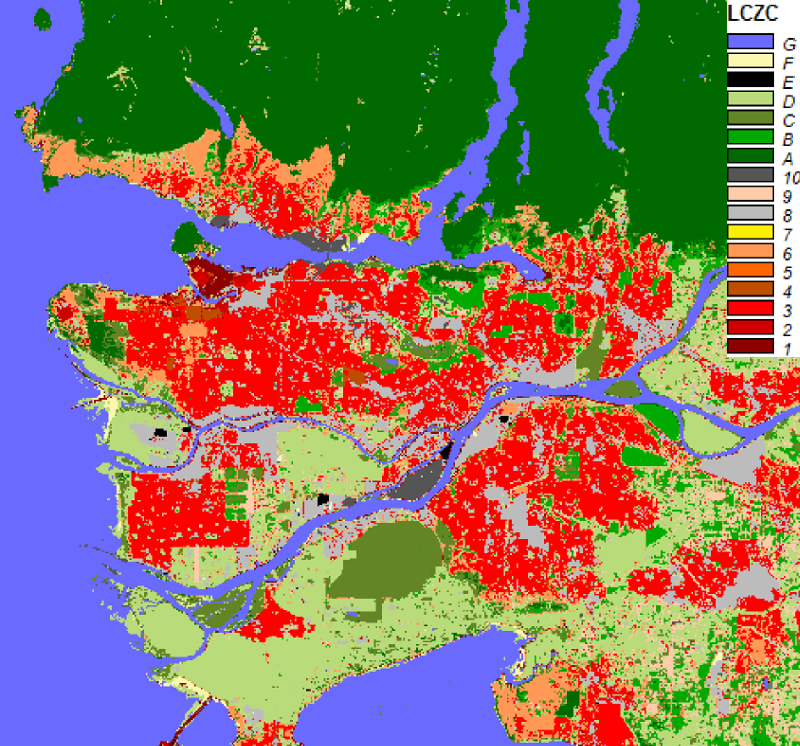

# So2Sat GUL - *So2Sat Global Urban LCZ*
## Introduction
This repository provides the analysis-ready Sentinel-1 and Sentinel-2 images and the corresponding local climate zones classification maps of 1692 cities whose population is larger than 300,000 according to the UN's World Prbanization Prospects: The 2014 Revision. The LCZ maps were predicted using deep learning and our pre-trained models in the So2Sat project, which is an European Research Council (ERC) starting grant ["So2Sat"](http://www.so2sat.eu/). Citation:

```bibtex
@article{zhu_so2sat_2021,
        title = {The Urban Morphology on Our Planet - Global perspectives from Space},
        volume = {pp},
        journal = {Remote Sensing of Environment},
        issn = {0034-4257},
        author = {Zhu, X. X. and Qiu, C. and Hu, J. and Shi, Y. and Wang, Y. and Schmitt, M. and Hannes Taubenböck},
        month = November,
        year = {2021},
}
```


Figure: local climate zone map of the city Vancouver

## Download So2Sat GUL
Including the analysis-ready Sentinel-1, Sentinel-2 images, and the LCZ maps of 1692 cities.
> https://mediatum.ub.tum.de/1633461

## Training data 
Please refer to this page
> https://github.com/zhu-xlab/So2Sat-LCZ42

# Running a demo using our pre-trained model
## Environment setting
This demo has been tested in a conda environment. The following steps create an identical conda environment as ours.
### Step 1: Install conda (version 4.9.1, where the code were tested)
[Please refer to the anaconda documentation](https://docs.anaconda.com/anaconda/install/)
### Step 2: Create the conda env
```bash
cd Conda-Env
conda env create -f sipeo_so2sat_demo_env.yml #Create env from yml file
conda activate sipeo_so2sat_demo #activate the conda env
```

## Exemplary data
Please download the exemplary data from the following link, and replace the directory "data".
> https://syncandshare.lrz.de/getlink/fiYCB4tz8yGrXaZnoTVqufTb/data.zip

## LCZ mapping workflow
This part shows the LCZ mapping workflow with the example of city Lagos.
### Step 1. LCZ mapping with Sentinel-1
```bash
cd Modules/3_classification #Browse to Modules/3_classification

#Produce a classification map for 00017_22007_Lagos with a trained model and Sentinel-1 data
python sen1InferenceResNet.py ../../data/Sentinel-1/00017_22007_Lagos model/S1_RESNET20_BS32_LR1e-4_IN32-32-7_PRO52A-R10-GLOBAL_2019-06-22.h5

#Produced classification map in ../../data/Sentinel-1/00017_22007_Lagos/LCZ_ResNet/[TIME]/LCZLabel.tif
```

### Step 2. LCZ mapping with Sentinel-2
```bash
cd Modules/3_classification #Browse to Modules/3_classification

#Produce a classification map for 00017_22007_Lagos with a trained model and multi-seasonal Sentinel-2 images
#The softmax probability of each season and the fused LCZ labels are saved into geotiff files.
CUDA_VISIBLE_DEVICES=0 python sen2InferenceResNet20.py '../../data/Sentinel-2/00017_22007_Lagos' 'model/S2_RESNET20_BS16_LR2e-4_IN32-32-10_PRO-52-0R12_2019-06-27.h5'

#Produced classification map ../../data/Sentinel-2/00017_22007_Lagos/LCZ_ResNet20/00017_22007_Lagos_lab.tiff
```

### Step 3. Fusing the results of Sentinel-1 and Sentinel-2
```bash
cd Modules/4_decision_fusion/ #Browse to Modules/4_decision_fusion/

#Decision fusion
python sen1sen2Fusion.py ../../data/Sentinel-1/00017_22007_Lagos ../../data/Sentinel-2/00017_22007_Lagos

#Produced fusion map: ../../data/MAP/00017_22007_Lagos/LCZ_Fusion/[TIME]/s1_s2_fusion.tif
```

## Extra: Data downloading and processing
Contents for data downloading and preprocessing can be found the following directory. Please refer to the README in those subdirectories for more details.
```
Modules/1_download
Modules/2_preprocessing
```
